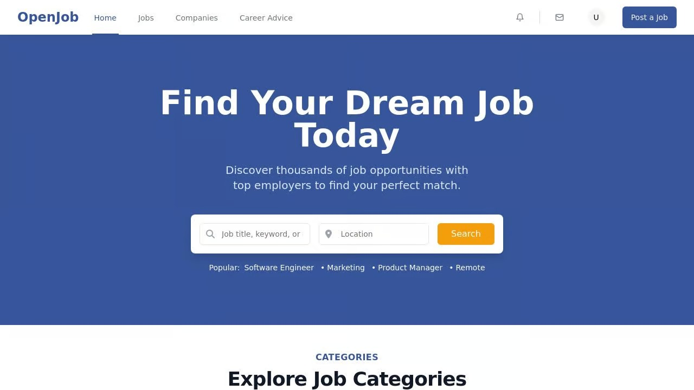

# Job Board Application




A full-stack job board application built with React, TypeScript, Express, and Drizzle ORM.

## Features

- User authentication and profiles
- Job posting and application
- Job search and filtering
- User application tracking
- CV upload functionality
- Responsive design

## Technology Stack

- **Frontend**: React, TypeScript, Tailwind CSS, Radix UI components
- **Backend**: Express, Node.js
- **Database**: Drizzle ORM with Neon Serverless Postgres
- **Form Handling**: React Hook Form with Zod validation

## Getting Started

### Prerequisites

- Node.js 20 or higher

### Installation

1. Clone the repository
2. Install dependencies:
   ```bash
   npm install
   ```

### Development

Run the development server:
```bash
npm run dev
```

This will start both the backend server and the frontend development server.

### Build

To build the application for production:
```bash
npm run build
```

### Database Management

Push schema changes to the database:
```bash
npm run db:push
```

## Project Structure

- `/client` - Frontend React application
- `/server` - Backend Express API
- `/shared` - Shared types and schema definitions

## API Endpoints

- `POST /api/auth/register` - Register a new user
- `POST /api/auth/login` - Log in a user
- `GET /api/jobs` - Get all jobs
- `GET /api/jobs/:id` - Get job details
- `POST /api/jobs` - Create a new job
- `POST /api/jobs/:id/apply` - Apply for a job
- `PUT /api/users/:id` - Update user profile
- `POST /api/users/:id/cv` - Upload a CV

## License

MIT
